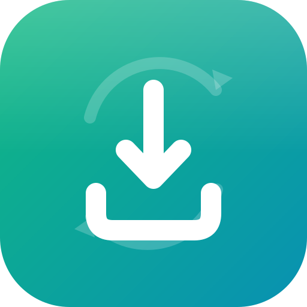
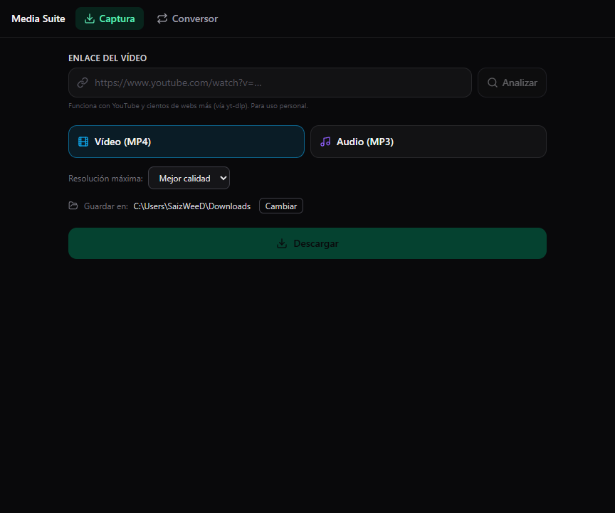
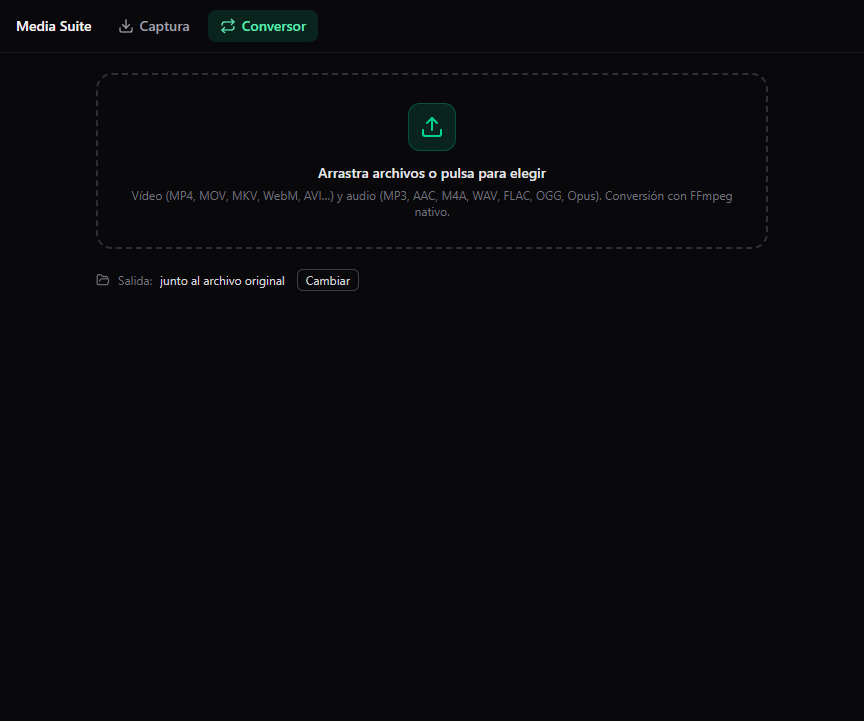

# Media Suite

**Descarga y convierte vídeo y audio — app de escritorio para Windows.**

Aplicación de escritorio que reúne dos herramientas en una interfaz limpia y rápida:

- 🎬 **Captura** — descarga vídeo o audio de YouTube y [cientos de webs más](https://github.com/yt-dlp/yt-dlp/blob/master/supportedsites.md).
- 🔄 **Conversor** — convierte entre formatos de vídeo y audio con **FFmpeg nativo**.

---

## 🖼️ Vistazo

| Captura (descargas) | Conversor |
|:--:|:--:|
|  |  |

---

## ⬇️ Descargar e instalar

Entra en **[Releases](../../releases/latest)** y elige:

| Archivo | Qué es |
|---|---|
| **`Media Suite Setup x.y.z.exe`** | Instalador para Windows (crea accesos directos). |
| **`Media Suite-x.y.z-win.zip`** | Versión **portable**: descomprime y ejecuta `Media Suite.exe`, sin instalar. |

> 💡 La primera vez que uses **Captura**, la app descarga `yt-dlp` automáticamente (una sola vez). **FFmpeg ya va incluido.**
>
> ⚠️ Al no estar firmada digitalmente, Windows SmartScreen puede avisar la primera vez → *Más información → Ejecutar de todas formas*.

---

## ✨ Características

**Captura**
- Descarga en **vídeo (MP4)** con resolución a elegir, o **audio (MP3)**.
- Vista previa de título, autor y duración antes de descargar.
- Progreso en tiempo real y acceso directo al archivo o su carpeta.

**Conversor**
- Arrastra y suelta archivos (o selección por diálogo nativo).
- **Vídeo↔vídeo**, **vídeo→audio** y **audio↔audio**.
- Selector de calidad y conversión por lotes.

| Vídeo | Audio |
|---|---|
| MP4 · MKV · MOV · WebM · AVI | MP3 · AAC · M4A · Opus · OGG · WAV · FLAC |

---

## 🧱 Cómo está hecho

| Capa | Tecnología |
|---|---|
| Escritorio | **Electron** + electron-vite |
| Interfaz | **React 19** · TypeScript · Tailwind CSS v4 |
| Descargas | **yt-dlp** (binario gestionado en runtime) |
| Multimedia | **FFmpeg** (binario embebido) |
| Empaquetado | electron-builder → instalador NSIS + ZIP |

**Arquitectura.** Separación estricta en tres procesos comunicados por un puente
IPC mínimo y tipado:

- **Main (Node).** Ciclo de vida de la app y operaciones con el sistema: lanza
  FFmpeg para convertir (con progreso parseado de su salida) y yt-dlp para
  descargar. Resuelve la ruta del binario de FFmpeg también en la app empaquetada
  (`app.asar.unpacked`).
- **Preload.** Expone una API mínima y segura (`window.api`) mediante
  `contextBridge` — la única vía por la que la interfaz habla con el sistema.
- **Renderer (React).** La interfaz, ejecutada con `contextIsolation` y **sin**
  `nodeIntegration`. No tiene acceso directo a Node ni al sistema de archivos.

---

## 🔒 Código

El código fuente de esta aplicación es **privado**. Este repositorio contiene la
ficha del proyecto y las descargas. Para una demo técnica o acceso al código,
contacta con el autor.

---

## ⚖️ Licencia

Software propietario — **todos los derechos reservados** ([LICENSE](LICENSE)).
Los binarios de *Releases* pueden usarse para fines **personales**.
Descarga únicamente contenido sobre el que tengas derechos; respeta los términos
de cada servicio.
