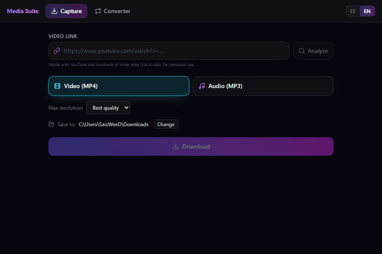

# Media Suite

**Download and convert video & audio — a desktop app for Windows.**

**English** · [Español](README.es.md)

A desktop application that bundles two tools in one clean, bilingual interface:

- 🎬 **Capture** — download video or audio from YouTube and [hundreds of other sites](https://github.com/yt-dlp/yt-dlp/blob/master/supportedsites.md).
- 🔄 **Converter** — convert between video and audio formats with **native FFmpeg**.

---

## 🖼️ A look

| Capture (downloads) | Converter |
|:--:|:--:|
|  |  |

---

## ⬇️ Download & install

Open **[Releases](../../releases/latest)** and choose:

| File | What it is |
|---|---|
| **`Media Suite Setup x.y.z.exe`** | Windows installer (creates shortcuts). |
| **`Media Suite-x.y.z-win.zip`** | **Portable** build: unzip and run `Media Suite.exe`, no install. |

> 💡 The first time you use **Capture**, the app downloads `yt-dlp` automatically (once). **FFmpeg is already bundled.**
>
> ⚠️ The app is unsigned, so Windows SmartScreen may warn on first launch → *More info → Run anyway*.

---

## ✨ Features

**Capture**
- Download as **video (MP4)** with selectable resolution, or **audio (MP3)**.
- Preview title, author and duration before downloading.
- Real-time progress and one-click access to the file or its folder.

**Converter**
- Drag & drop files (or pick them via a native dialog).
- **Video↔video**, **video→audio** and **audio↔audio**.
- Quality selector and batch processing.

| Video | Audio |
|---|---|
| MP4 · MKV · MOV · WebM · AVI | MP3 · AAC · M4A · Opus · OGG · WAV · FLAC |

🌐 **Bilingual UI** — English / Spanish, auto-detected and switchable in-app.

---

## 🧱 How it's built

| Layer | Technology |
|---|---|
| Desktop | **Electron** + electron-vite |
| UI | **React 19** · TypeScript · Tailwind CSS v4 |
| Downloads | **yt-dlp** (binary managed at runtime) |
| Media | **FFmpeg** (bundled binary) |
| Packaging | electron-builder → NSIS installer + ZIP |

**Architecture.** Strict separation into three processes communicating through a
minimal, typed IPC bridge:

- **Main (Node).** App lifecycle and system operations: runs FFmpeg to convert
  (with progress parsed from its output) and yt-dlp to download. Resolves the
  FFmpeg binary path even in the packaged app (`app.asar.unpacked`).
- **Preload.** Exposes a minimal, secure API (`window.api`) via `contextBridge`
  — the only channel between the UI and the system.
- **Renderer (React).** The UI, running with `contextIsolation` and **no**
  `nodeIntegration`. No direct access to Node or the file system.

---

## 🔒 Source code

The source code of this app is **private**. This repository hosts the project
page and the downloads. For a technical demo or code access, contact the author.

---

## ⚖️ License

Proprietary software — **all rights reserved** ([LICENSE](LICENSE)).
Binaries under *Releases* may be used for **personal** purposes.
Only download content you have the rights to, and respect each service's terms.
